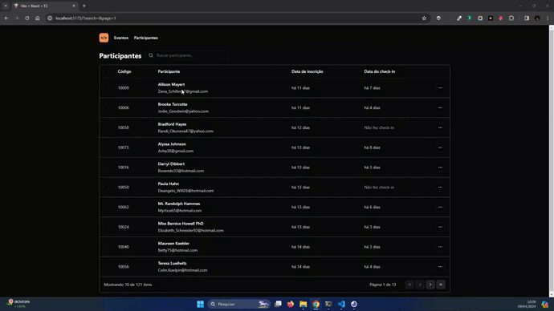

# Pass.in - Gestão de Participantes em Eventos Presenciais
A plataforma Pass.in é uma ferramenta de gerenciamento de participantes de eventos, equipada com um painel de controle para os organizadores e participantes.

Um dos aspectos mais destacados deste projeto é a utilização de persistência de estados de URL, garantindo a continuidade das interações dos usuários mesmo após a atualização da página. Além disso, destaca-se a implementação de uma interface completamente padronizada, seguindo os princípios de design com o auxílio do Tailwind CSS.

# 🚀 Características

- Integração com API em Node.js
- Pesquisa por participante
- Paginação
- Definir instruções de URL com parâmetros de consulta
- [Swagger](https://nlw-unite-nodejs.onrender.com/docs/static/index.html)
- Diagrama ERD


# Preview




# 🛠️ Tecnologias utilizada

- React
- Vite
- TypeScript
- Tailwind
- Lucide icons
- Backend com Node.js e Prisma

# 📚 Blibiotecas

- Tailwind-merge
- FakerJS
- DayJS

# 👷 Para executar o projeto:
## Inicie o front-end

Clonar repositório

```
https://github.com/carolprotasio/pass-in-web.git
```
Instalar dependências

```
npm i
```
Iniciar aplicação

```
npm run dev
```
## Configure o back-end

Backend utilizado disponível em [RocketNodeJs](https://github.com/rocketseat-education/nlw-unite-nodejs)


**Você precisa instalar o [Node.js](https://nodejs.org/en/download/) e depois, clonar o projeto via HTTPS, usando o comando abaixo:**

```
git clone https://github.com/rocketseat-education/nlw-unite-nodejs.git
```

**Instalar dependências**

```
npm i
```

**Criar o arquivo .env e colar o seguinte código**
```env
DATABASE_URL="file:./dev.db"
```

**Preencha o banco de dados com o comando**
```bash
npx prisma db seed
```

**Iniciar o servidor**
```bash
npm run dev
```

# Créditos
Este projeto foi desenvolvido com base no tutorial oferecido pela Rocketseat durante o evento NJW Unite. Agradeço à equipe da Rocketseat por fornecer recursos valiosos e conhecimento técnico.
